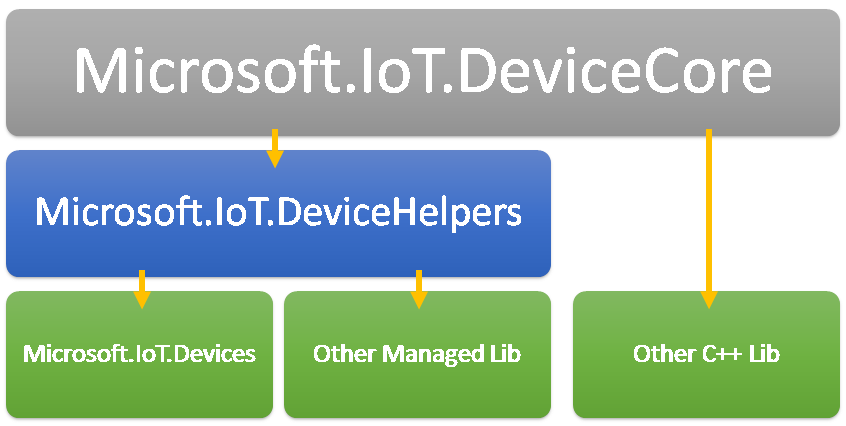
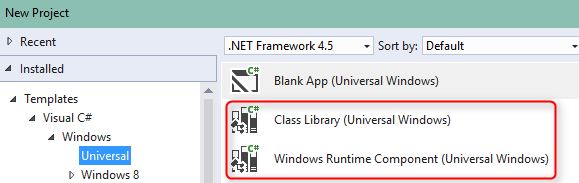
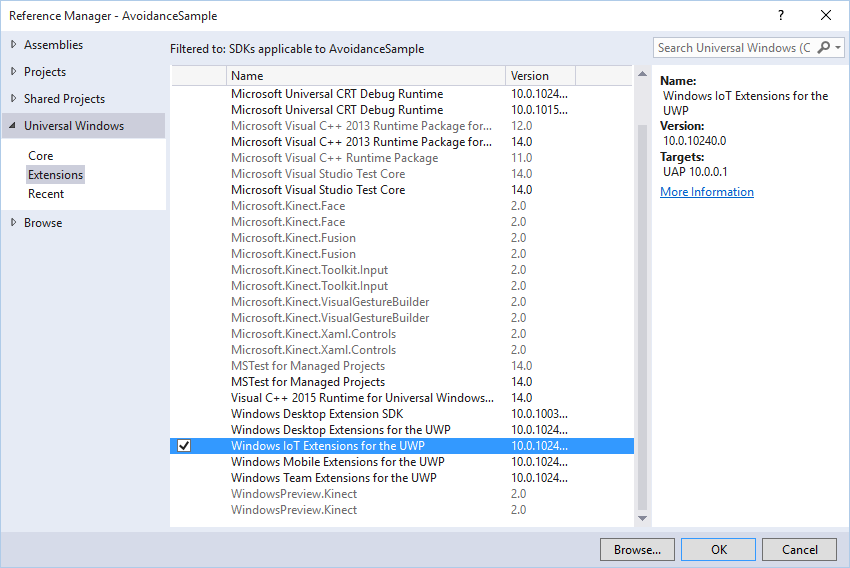
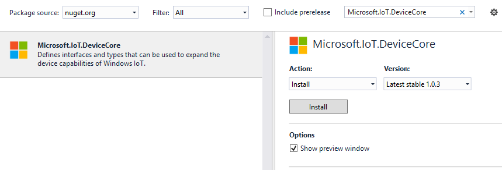
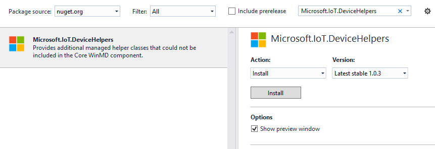

# Building a Custom Library #
**Microsoft.IoT.Devices** was designed from the ground up to be extensible. This page describes how to build a custom device library and add support for your own devices.

## Components ##
The first step in building a custom device library is understanding the underlying components that make up the library. **Microsoft.IoT.Devices** is actually a hierarchy of 3 libraries:

### Microsoft.IoT.DeviceCore ###
**DeviceCore** defines the classes and well-known interfaces that can be implemented by other device libraries. This is a [Windows Runtime Component](https://msdn.microsoft.com/en-us/library/windows/apps/xaml/hh441572.aspx), which means it can be used in any programming language supported by the Windows Runtime (this includes C++, C#, VB and JavaScript). Examples of the types included in this component are **ISwitch**, **IPushButton** and **AdcControllerManager**.

### Microsoft.IoT.DeviceHelpers ###
**DeviceHelpers** provides additional helper classes that couldn't be included in the **DeviceCore** library. Because **DeviceCore** is a Windows Runtime Component, [certain restrictions](https://msdn.microsoft.com/en-us/library/windows/apps/xaml/br230301.aspx) are placed on the types that can be exported from it. Since **DeviceHelpers** is a Class Library and not a Runtime Component those restrictions don't apply. This does mean that **DeviceHelpers** can only be used to build custom libraries using managed languages (e.g. C# and VB) but the classes provided by **DeviceHelpers** are not critical; they are mainly time savers. **DeviceHelpers** includes classes like **ObservableEvent**, **PushButtonHelper** and a number of custom exception classes.  

### Microsoft.IoT.Devices ###
**Devices** is the library that most IoT developers actually use. It's built on top of **DeviceCore** and **DeviceHelpers** and it includes implementations of the core interfaces defined in **DeviceCore**. For example it includes classes like **Switch**, **PushButton** and **RotaryEncoder**. The **Devices** library is a Runtime Component even though it leverages **DeviceHelpers** internally. This is possible because it doesn't *publicly* expose any types from the **DeviceHelpers** library.

## Create the Library ##
The recommended approach for building a custom library is exactly the same approach that was taken to build **Microsoft.IoT.Devices**.

If you know that your custom library will only be used in *managed* projects, it's easier to just create it as a Class Library. However, if there's a chance your custom library might need to be used by unmanaged languages like JavaScript it's best to start from the beginning as a Runtime Component. A project can always be changed from a Class Library to a Runtime Component or vice versa under project properties. Just be aware that you will likely have some extra work to do if you didn't plan for the Runtime Component restrictions from the beginning.

### References ###
Once the custom library has been created it's time to add references to the underlying components.

No matter what language your library is written in, you'll need to reference the IoT Extension SDK. This is part of the Windows Runtime itself and to reference it, right-click on the References folder inside our project and choose **Add Reference…**. In the window that pops up expand the **Windows Universal** branch on the left and select **Extensions**. Then, check the box next to **Windows IoT Extensions for the UWP** on the right and click OK to close the dialog.

Also no matter what language you're using, add a reference to the **Microsoft.IoT.DeviceCore** library. To do this, right-click on the **References** folder inside the project and choose **Manage NuGet Packages**. In the window that pops up type **Microsoft.IoT.DeviceCore** in the search box.

Select **Microsoft.IoT.DeviceCore** on the left-hand side and click the **Install** button on the right.

Finally, if you're using a managed language to build your custom library also add a reference to the **Microsoft.IoT.DeviceHelpers** library.

